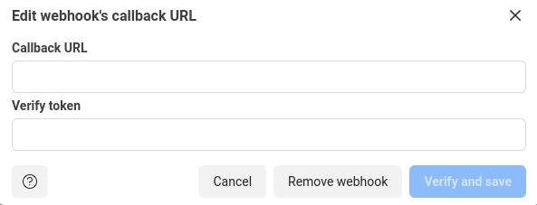
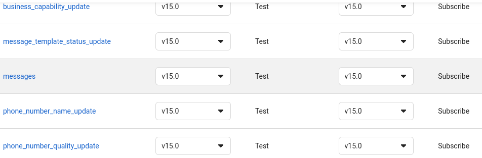
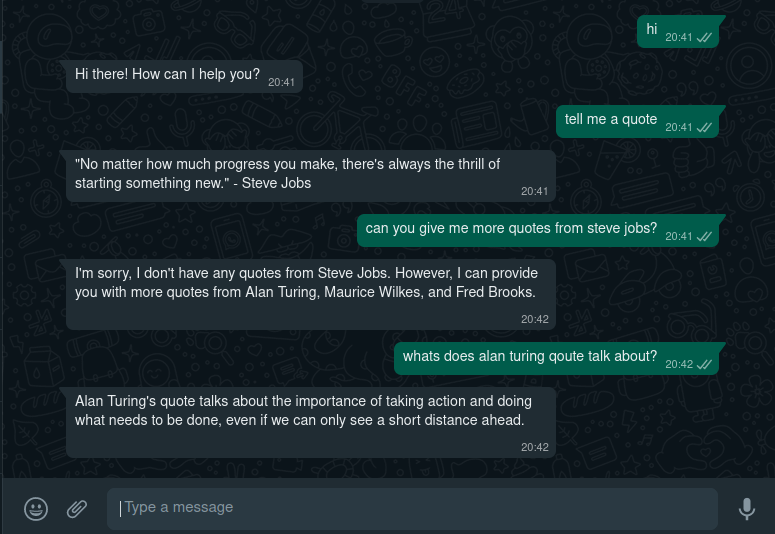

# Whatsapp ChatBot created from document

Deploying chatbot created from document. In this project we are going to use whatsapp cloud API, OpenAI
 and Ngrok

## Getting whatsapp creds

To proceed with whatsapp integration, you will need **TOKEN** and **TEST WHATSAPP NUMBER ID** (the library works either with a production phone number, if you have one) which you can get from the [Facebook Developer Portal](https://developers.facebook.com/)

Here are steps to follow for you to get started:

    1. [Go to your apps](https://developers.facebook.com/apps)
    2. [create an app](https://developers.facebook.com/apps/create/)
    3. Select Business >> Business
    4. It will prompt you to enter basic app informations
    5. It will ask you to add products to your app a. Add WhatsApp Messenger
    6. Right there you will see a your `TOKEN` and `TEST WHATSAPP NUMBER` and its `phone_number_id`
    7. Lastly verify the number you will be using for testing on the To field.

Once you've followed the above procedures you're ready to start the integration.

## Preparations

1. Create  project directory

Lets create our project directory/folder. We are going to make a folder named `whatsapp bot`.

    ```bash
    mkdir "Whatsapp bot"
    cd "Whatsapp bot"
    ```

2. Create Virtual environment

It is good practice to have virtual environment for development of your python projects. Lets make a virtual environment named `mybot`. Then activate the environment

    ```bash
    python3 venv -m mybot
    source mybot/bin/activate
    ```

3. Install packages

Now clone the repo and install necessary packages by running

    ```bash
    git clone https://github.com/jovyinny/whatsapp-bot-from-document.git
    cd whatsapp-bot-from-document
    pip3 install -r requirements.txt
    ```

4. Make .env file

Lets make `.env` file in our `whatsapp-bot-from-document` to hold our environment variables or secrets. It will hold our private keys from whatsapp and apenai
Open your `whatsapp-bot-from-document`, add file and add your credentials.

    ```text
    openai_key      ="your openAI API key"
    phone_number_id = "Your whatsapp phone number ID"
    whatsapp_token  = "Your whatsapp token"
    ```

## Fire Up your project

Once you have environment variables set, you are ready to fire 🚀 your `main.py` in activated virtual envirnoment.

1. Fire up your python script
  
    ```bash
    python3 main.py
    ```
  
2. Start ngrok

  ```bash
  ./ngrok http 5000
  ```

**`Note:`** Keep the port number the same as used in `main.py`

## Finish up
  
After running the command, you will have to copy the url ngrok provides. The url looks like `https://xxxxxxxxxxx.ngrok.io`

With the provided url, follow simple steps at [Setting whatsapp webhook](#setting-whatsapp-webhook).

Open `main.py`, copy the `VERIFY_TOKEN`--> paste into verify token in your whatsapp cloud --> **verify and save**.

We are heading a the best part of this journey. Just take time to [subscribe to message topic](#webhook-field-subscription).
When done ,you are good to go... fire up your bot in whatsapp by sending text.

🏁 When done with saving the token and url, go on to text your bot. Check out the sample [below](#sample-bot-test)

## Setting whatsapp webhook

Navigate to your whatsapp cloud account --> `configuration` --> edit --> then paste the url into callback url.



## Webhook field subscription

After veryfing and saving whatsapp webook, navigate to webhook fields --> click `manage` to subscribe to `message` topic.



## Sample bot test

Here is a sample bot after deployement.
